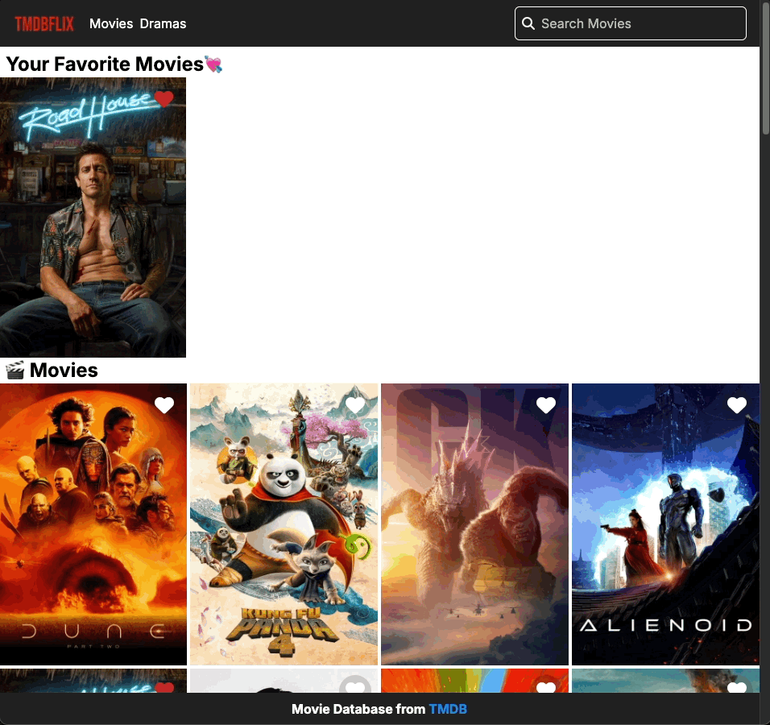
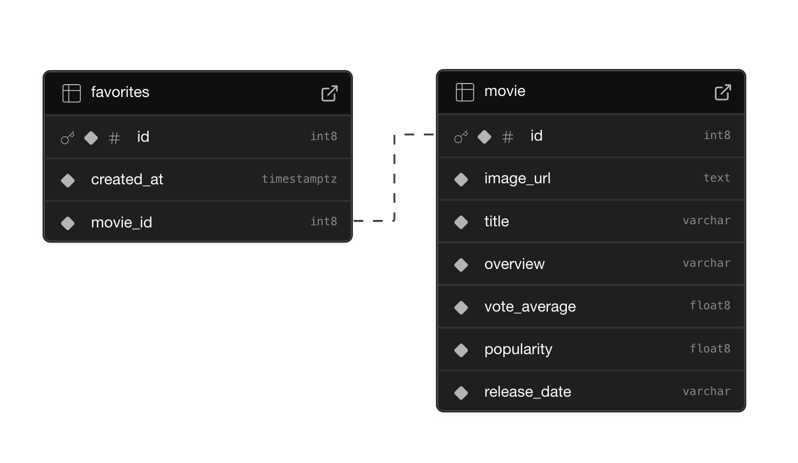

## Netflix Clone

Next.js(Server Action, React Query, Material Tailwind, Recoil, Swiper) + Supabase(TMDB data)

인프런 워밍업 스터디 3기 풀스택 3주차 미션3 입니다.  
[강의: [풀스택 완성]Supabase로 웹사이트 3개 클론하기(Next.js 14)](https://www.inflearn.com/course/%EC%9A%94%EC%A6%98%EC%97%94-supabase-%EB%8C%80%EC%84%B8%EC%A7%80-nextjs-%ED%81%B4%EB%A1%A0%ED%94%84%EB%A1%9C%EC%A0%9D%ED%8A%B8/dashboard)

### 찜 추가/삭제


### 영화 검색 및 영화 상세



### 무한 스크롤


### 반응형 Swiper, gird


## 미션: Netflix Clone 프로젝트에 “찜하기” 기능을 추가하세요.

- 사용자가 특정 영화를 “찜”할 수 있도록 Supabase를 활용해 즐겨찾기 리스트 구현
- 찜한 영화를 영화 리스트 화면의 최상단으로 보여주도록 정렬

### 미션 해결 과정:

### 1. 추후 회원 기능 추가를 위해 Supabase에서 “찜(favorites) 테이블”을 생성한다.


  
    
`favorites` : 사용자가 찜한 영화를 저장하는 테이블

한 영화(`movie.id`)는 여러 사용자의 `favorites`에 포함될 수 있다. (**1:N 관계**)

| 컬럼명     | 데이터 타입 | 설명                                                                                                                                                                 |
| ---------- | ----------- | -------------------------------------------------------------------------------------------------------------------------------------------------------------------- |
| id         | int8        | favorites 테이블의 기본 키(PK)                                                                                                                                       |
| created_at | timestamptz | 즐겨찾기 추가 시간<br>timestamp with timezone 타입                                                                                                                   |
| movie_id   | int8        | **movie 테이블의 id를 참조하는 외래 키(FK)**<br>- 찜한 영화의 ID<br>- favorites.movie_id 값은 항상 movie.id 값 중 하나여야 함 (존재하지 않는 영화 ID를 가질 수 없음) |

### 2. 전체 영화 리스트와 찜 상태를 함께 가져오는 RCP 함수 정의

Supabase에서 서브쿼리를 사용하여 영화와 찜 상태를 가져오는 `get_movies_with_favorites`라는 **Remote Procedure Call (RPC) 함수**를 정의한다.  
이 함수는 영화 제목을 검색하고, 해당 영화가 찜 목록에 있는지 여부(boolean)를 `favorite` 컬럼으로 반환한다.

[JavaScript: Call a Postgres function | Supabase Docs](https://supabase.com/docs/reference/javascript/rpc)

`get_movies_with_favorites`

```sql
-- DROP FUNCTION IF EXISTS get_movies_with_favorites(varchar, integer, integer);
create or replace function get_movies_with_favorites(search varchar, page int, page_size int)
returns table (
  id int8,
  image_url text,
  title varchar,
  overview varchar,
  vote_average float8,
  popularity float8,
  release_date varchar,
  favorite boolean
) as $$
begin
  return query
  select
    movie.*,
    exists (
      select 1
      from favorites
      where favorites.movie_id = movie.id
    ) as favorite
  from movie
  where movie.title like '%' || search || '%'
  limit page_size offset (page - 1) * page_size;
end;
$$ language plpgsql;
```

### 3. 기존 영화 목록 불러오기 로직 변경

기존의 `movie` 테이블에서 `select`를 사용해 영화를 불러오는 로직을:

```tsx
export async function searchMovies({ search = "", page, page_size }) {
  // ...

  const { data, count, error } = await supabase
    .from("movie")
    .select("*")
    .like("title", `%${search}%`)
    .range((page - 1) * pageSize, page * pageSize - 1);

  // ...
}
```

위에서 정의한 `get_movies_with_favorites` RPC를 호출하는 방식으로 변경한다.:

```tsx
export async function searchMovies({ search = "", page, page_size }) {
  // ...

  const { data, error } = await supabase.rpc("get_movies_with_favorites", {
    search,
    page,
    page_size,
  });

  // ...
}
```

그 결과 찜 상태를 포함한 영화를 응답받을 수 있다.:

```tsx
[
  {
    id: 1,
    image_url:
      "https://image.tmdb.org/t/p/w500/1pdfLvkbY9ohJlCjQH2CZjjYVvJ.jpg",
    title: "Dune: Part Two",
    overview:
      "Follow the mythic journey of Paul Atreides as he unites with Chani and the Fremen while on a path of revenge against the conspirators who destroyed his family. Facing a choice between the love of his life and the fate of the known universe, Paul endeavors to prevent a terrible future only he can foresee.",
    vote_average: 8.3,
    popularity: 3437.313,
    release_date: "2024-02-27",
    favorite: false,
  },
  {
    id: 2,
    image_url:
      "https://image.tmdb.org/t/p/w500/kDp1vUBnMpe8ak4rjgl3cLELqjU.jpg",
    title: "Kung Fu Panda 4",
    overview:
      "Po is gearing up to become the spiritual leader of his Valley of Peace, but also needs someone to take his place as Dragon Warrior. As such, he will train a new kung fu practitioner for the spot and will encounter a villain called the Chameleon who conjures villains from the past. movie HD QUALITY, open this link leakedcinema.com",
    vote_average: 7.146,
    popularity: 2340.977,
    release_date: "2024-03-02",
    favorite: false,
  },
  // ...
];
```

### 4. 영화 카드 컴포넌트에서 찜 상태 반영

`components/movie-card.tsx`

```tsx
export default function MovieCard({ movie }) {
  async function handleClick(favorite: boolean) {
    if (favorite) {
      await insertFavoriteMutaion.mutate();
    } else {
      await deleteFavoriteMutaion.mutate();
    }
  }

  return (
    <div className="col-span-1 relative">
      // ...
      {/* 찜하기 버튼 */}
      <div
        className={`z-30 absolute top-2 right-2 rounded-full bg-gray-900/20 hover:bg-gray-900 transition duration-300`}
      >
        <IconButton
          variant="text"
          className="rounded-full"
          onClick={() => {
            handleClick(!movie.favorite);
          }}
        >
          {insertFavoriteMutaion.isPending ||
          deleteFavoriteMutaion.isPending ? (
            <Spinner />
          ) : (
            <i
              className={`fas fa-heart text-2xl ${
                movie.favorite ? "text-red-800" : "text-white"
              }`}
            />
          )}
        </IconButton>
      </div>
      // ...
    </div>
  );
}
```

`MovieCard` 컴포넌트에서 각 영화의 찜 상태(favorite)에 맞게 버튼 색상을 변경하고, 클릭 시 `handleClick` 함수로 찜 상태를 변경하고 해당 상태를 `mutate`를 통해 서버와 동기화한다.

### 4-1. 찜 상태 반영 후 데이터 업데이트

```tsx
const insertFavoriteMutaion = useMutation({
  mutationFn: () => insertFavorite(movie.id),
  onSuccess: () => {
    queryClient.invalidateQueries({
      queryKey: ["favoritesMovieList"],
    });
    queryClient.invalidateQueries({
      queryKey: ["movie"],
    });
  },
});
```

`insertFavoriteMutaion`과 `deleteFavoriteMutaion`에서 각각 찜 추가 및 삭제가 성공하면 `queryClient.invalidateQueries`를 사용해 관련된 데이터를 새로고침하여 UI를 최신 상태로 반영하여 유지한다.

### 5. 화면 상단에 보여질 찜한 영화 리스트 불러오기

Supabase에서 두 테이블을 외래키 기준으로 조인하여 찜한 영화 목록만 가져온다.

`Query nested foreign tables through a join table` - [JavaScript: Fetch data | Supabase Docs](https://supabase.com/docs/reference/javascript/select)

`actions/movieActions.ts`

```tsx
export async function getFavoritesMovie() {
  const supabase = await createServerSupabaseClient();

  const { data, error } = await supabase
    .from("favorites")
    .select(`*, movie!favorites_movie_id_fkey(*)`)
    .order("created_at", { ascending: false });

  if (error) {
    handleError(error);
  }

  return data.map((item) => ({
    ...item,
    movie: {
      ...item.movie,
      favorite: true,
    },
  }));
}
```

여기서 `movie` 정보에 `favorite` 프로퍼티를 추가하고, 찜한 영화 목록이므로 모든 영화에 `favorite: true`를 설정한다.

응답 예시:

```tsx
[
  {
    id: 78,
    created_at: "2025-03-22T13:19:51.598+00:00",
    movie_id: 1,
    movie: {
      id: 1,
      title: "Dune: Part Two",
      overview:
        "Follow the mythic journey of Paul Atreides as he unites with Chani and the Fremen while on a path of revenge against the conspirators who destroyed his family. Facing a choice between the love of his life and the fate of the known universe, Paul endeavors to prevent a terrible future only he can foresee.",
      image_url:
        "https://image.tmdb.org/t/p/w500/1pdfLvkbY9ohJlCjQH2CZjjYVvJ.jpg",
      popularity: 3437.313,
      release_date: "2024-02-27",
      vote_average: 8.3,
      favorite: true,
    },
  },
];
```

### 6. 찜한 목록 Swiper 적용하여 화면 상단에 출력하기

`components/movie-favorites-list.tsx`

찜한 영화가 없을 경우, 데이터를 추가할 수 있도록 전체 영화 리스트로 스크롤 이동 버튼을 추가한다.

```tsx
"use client";

import { useRef } from "react";

export default function MovieFavoritesList() {
  // 전체 영화 리스트로 스크롤 이동
  const moveRef = useRef(null);
  const scrollToAllMovies = () => {
    moveRef.current?.scrollIntoView({
      behavior: "smooth",
      block: "start",
    });
  };

  return (
    // ...
    <>
      <div className="flex justify-center items-center pt-16 pb-8">
        <div className="flex flex-col items-center space-y-4">
          {getFavoritesMovieQuery.isLoading ? (
            <Spinner />
          ) : (
            <>
              <p className="text-xl">좋아하는 영화를 추가해보세요.</p>
              <button
                onClick={scrollToAllMovies}
                className="w-12 h-12 bg-gray-900 text-white rounded-full flex items-center justify-center shadow-lg hover:bg-black transition duration-300"
              >
                <i className="fa fa-angle-double-down" />
              </button>
            </>
          )}
        </div>
      </div>
      <div className="p-8" ref={moveRef}></div>
    </>
    // ...
  );
}
```

찜한 영화가 있을 경우, Swiper를 적용하여 캐러셀 형식으로 나타낸다.

```tsx
// ...
import { getFavoritesMovie } from "actions/movieActions";
import { Navigation } from "swiper/modules";
import { Swiper, SwiperSlide } from "swiper/react";
import "swiper/css";
import "swiper/css/navigation";

export default function MovieFavoritesList() {
  // ...

  const getFavoritesMovieQuery = useQuery({
    queryKey: ["favoritesMovieList"],
    queryFn: () => getFavoritesMovie(),
  });

  return (
    <div className="w-full">
      <h1 className="px-2 text-2xl font-bold">Your Favorite Movies💘</h1>
      {getFavoritesMovieQuery.isLoading ||
      !getFavoritesMovieQuery?.data.length ? (
          // 데이터가 없는 경우
      ) : (
        <Swiper
          modules={[Navigation]}
          spaceBetween={5}
          slidesPerView={4}
          breakpoints={{
            0: { slidesPerView: 1 }, // 반응형 적용
            320: { slidesPerView: 2 },
            540: { slidesPerView: 3 },
            720: { slidesPerView: 4 },
            1024: { slidesPerView: 5 },
          }}
          navigation={{
            nextEl: ".custom-swiper-button-next", // 커스텀 스타일 적용
            prevEl: ".custom-swiper-button-prev",
          }}
          className="relative"
        >
          <button className="custom-swiper-button-prev absolute left-2 top-1/2 transform -translate-y-1/2 w-10 h-10 bg-black/50 text-white rounded-full flex items-center justify-center hover:bg-black/80 disabled:opacity-0 disabled:cursor-auto transition duration-300 z-10">
            ◀
          </button>
          <button className="custom-swiper-button-next absolute right-2 top-1/2 transform -translate-y-1/2 w-10 h-10 bg-black/50 text-white rounded-full flex items-center justify-center hover:bg-black/80 disabled:opacity-0 disabled:cursor-auto transition duration-300 z-10">
            ▶
          </button>
          {getFavoritesMovieQuery.data.map((item) => (
            <SwiperSlide key={item.id}>
              <MovieCard movie={item.movie} />
            </SwiperSlide>
          ))}
        </Swiper>
      )}
    </div>
  );
}
```
